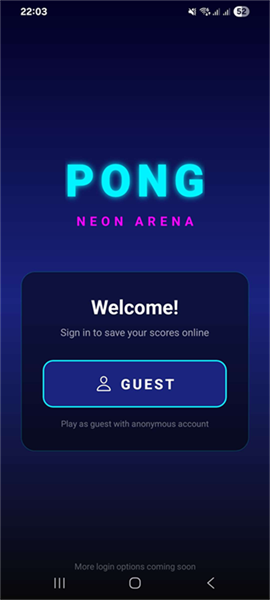
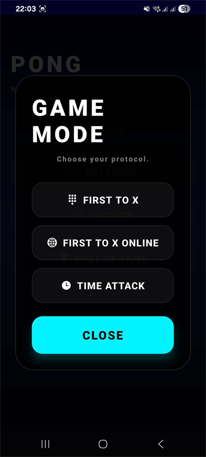
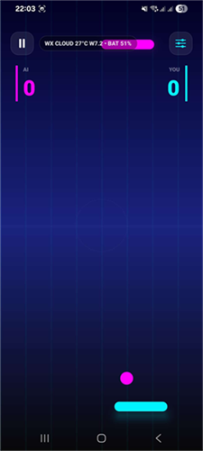
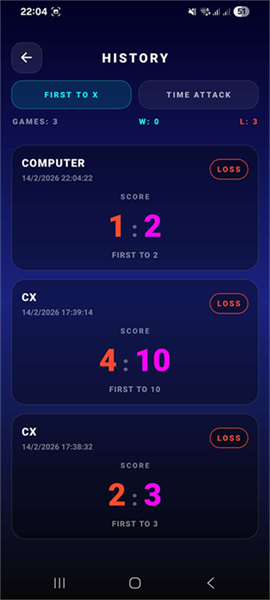
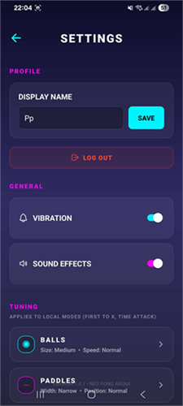

# How to use

Complete guide for installing, running, and understanding the core data flow of the Pong Vertical app.

## Installation

1. Install Node.js (LTS recommended).
2. Install dependencies:

```bash
npm install
```

3. Create `.env` from template:

```bash
# macOS / Linux
cp .env.example .env

# Windows PowerShell
Copy-Item .env.example .env
```

4. Fill required environment values in `.env`:
- `EXPO_PUBLIC_FIREBASE_DATABASE_URL`
- `EXPO_PUBLIC_FIRESTORE_BASE_URL`
- `EXPO_PUBLIC_FIREBASE_PROJECT_ID`

5. Start the Expo dev server:

```bash
npm run start
```

6. Run your target platform:
- Android: `npm run android`
- iOS: `npm run ios`
- Web: `npm run web`

## User Guide

### 1) Login
- Open app and tap `GUEST` to sign in with anonymous/local identity.

Image example (add your own screenshot):


### 2) Start Game
- Choose game mode from main menu:
  - `FIRST_TO_X`
  - `TIME_ATTACK`
- Configure settings, then start the match.

Image example:


### 3) During Match
- Play vertical pong.
- Score and timer are tracked in real time.
- Match data is stored locally first and synced online when available.

Image example:


### 4) View History and Leaderboard
- Open `History` to see previous matches.
- Open `Leaderboard` to see top entries and compare results.

Image example:


### 5) Settings
- Update profile/display name.
- App applies local-first behavior and syncs when network is available.

Image example:


## API and Data Model (Overview)

### Main data modules
- `lib/db.ts`: high-level data APIs used by UI/components.
- `lib/sqlite.ts`: local offline database with tables and CRUD.
- `lib/firebase.ts`: remote persistence/sync transport.
- `lib/sync.ts`: sync orchestration logic between local and remote data.

### Core entities

#### `Player`
- `player_id`: unique user id
- `player_name`: display name
- `player_created_date`: creation timestamp
- `count_win`, `count_lose`: aggregated stats

#### `ScoreFirstToX`
- `score01_id`: unique match id
- `player_id`, `player_id1`: players in match
- `score01_player`, `score01_player1`: final score
- `score01_winner`: winner player id
- `score01_time_elapse`: elapsed seconds
- `score01_target`: target score for this match
- `score01_created_date`: timestamp

#### `ScoreTimeAttackX`
- `score02_id`: unique match id
- `player_id`: owner of score
- `score02_verdict`: `WIN` or `LOSE`
- `score02_time_duration`: actual duration/survival time
- `score02_target_seconds`: configured target duration
- `score02_created_date`: timestamp

### Data flow summary

1. Game ends and score is generated.
2. Data is saved to SQLite first (`local-first`).
3. App attempts Firebase sync when online.
4. If sync fails/offline, data remains local and retries later.
5. History/leaderboard merge local + remote records.

## Notes

- Keep secrets only in `.env` (not committed).
- Share only template keys in `.env.example`.
- If images are missing, create files under `docs/images/` matching the names above.
